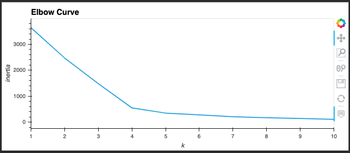
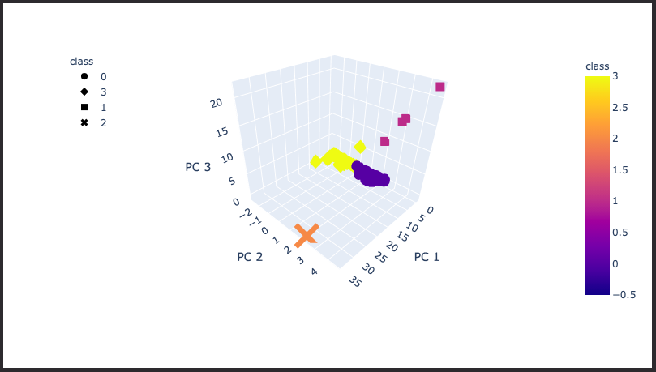
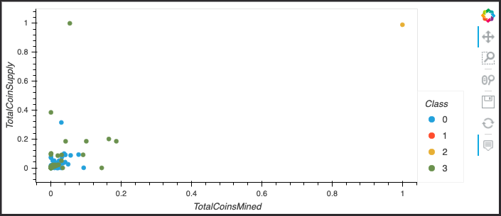

# Cryptocurrencies

## Overview of Project

### Purpose

Our objective is to use unsupervised machine learning to discover trends amongst cryptocurrency data. The data will be preprocessed, have its dimensions reduced, and clustered with K-means before it is visualized.

### Resources
- Data: [crypto_data.csv](Resources/crypto_data.csv)
- Software: Python, pandas, scikit-learn, plotly

## Project Results

### Preprocessing the Data for Principal Component Analysis (PCA)

Before we could begin our unsupervised learneing we needed to preprocess the data. To do this we converted all our string data using `.get_dummies()` and standardize all the data with `StandardScaler()`.

### Reducing Data Dimensions Using PCA

Using PCA we reduced the data dimensions to 3 principal components. These are the three main dimensions of variation that contain most of the information in the original dataset.

### Clustering Cryptocurrencies Using K-Means

In order to cluster our data, we first need to determine how many clusters there are. By graphing an Elbow Curve we were able to determine that we needed 4 clusters for the K-Means model.
 
After initializing our KMeans model with 4 clusters, we then used our `model.fit(pcs_df)` and `model.predict(pcs_df)` to classify the data.

### Visualizing Results

The next step after classifying the data was to visualize the data. We used a 3D scatter plot to visualize the data points and their differing values for each principal component:

Lastly, we wanted to visualize just the two variables "TotalCoinSupply" and "TotalCoinsMined":

